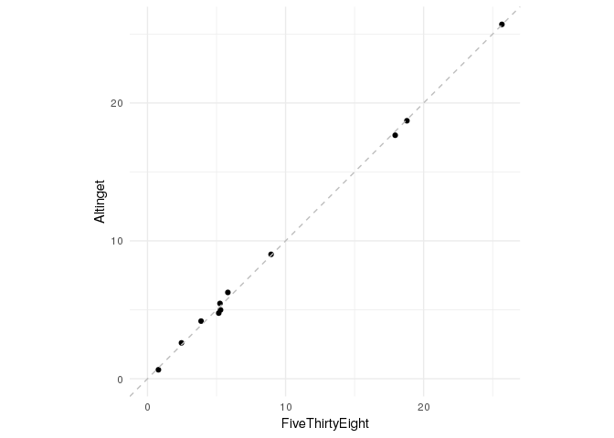

<!-- README.md is generated from README.Rmd. Please edit that file -->
pollofpolls
===========

The goal of pollofpolls is to make it easy to make a poll of polls.

This package is open sourced and all contributions are welcome. I have made some methodological choices in this implementation that you are more than welcome to challenge.

Please do so by raising issues here on github and / or by creating new functions and doing a pull request.

In the code of each function I have tried to document my choices as good as possible. Please raise an issue if you feel something is wrong or missing.

### Several poll of polls methods

There are now two methods available for calculating poll of polls:

#### The FiveThirtyEight Way

The methodology used is based on these two articles:

<https://greenbookblog.org/2018/01/16/the-prediction-how-nate-silver-does-it/>

<https://fivethirtyeight.com/features/the-polls-are-all-right/>

This is the way used in example one and two

#### The Altinget Way

The methodology there is based on hear say. It is pretty intuitive - read the documentation for the function: pp\_poll\_of\_poll\_summariser()

This is the way used in example three.

Installation
------------

You can install pollofpolls from github with:

``` r
# install.packages("devtools")
devtools::install_github("mikkelkrogsholm/pollofpolls")
```

Example one: Driverless poll of polls
-------------------------------------

This is hands free driverless poll of polls calculation.

``` r
library(pollofpolls)

pollofpoll <- suppressMessages(pp_auto_poll_of_poll()) 

# Round the digits so it looks pretty
pollofpoll[, 1:2] <- purrr::map(pollofpoll[, 1:2], round, 2)

# Make a better looking table
knitr::kable(pollofpoll)
```

|   pred|  error| party |
|------:|------:|:------|
|  25.67|   0.76| a     |
|   5.29|   0.56| aa    |
|   5.82|   0.51| b     |
|   3.88|   0.31| c     |
|   2.46|   0.43| d     |
|   5.25|   0.50| f     |
|   5.16|   0.52| i     |
|   0.79|   0.11| k     |
|  17.94|   0.89| o     |
|   8.95|   0.13| oe    |
|  18.79|   0.59| v     |

Example two: Run down of each function
--------------------------------------

This is basically a run through of each part of the driverless poll of polls.

``` r
library(pollofpolls)

# Download the raw polls
raw_polls <- pp_get_raw_polls()

# Do a check on the polls
checked_polls <- pp_check_raw_polls(raw_polls = raw_polls, silent = TRUE)

# Calculate the pollster rating
pollster_rating <- pp_calc_pollster_rating()

# Add weights to the polls
polls_with_wt <- pp_add_weights(checked_polls = checked_polls, 
                                pollster_rating = pollster_rating)

# Calculate the final pole
final_poll <- pp_calc_poll(polls_with_wt = polls_with_wt)

# Round the digits so it looks pretty
final_poll[, 1:2] <- purrr::map(final_poll[, 1:2], round, 2)

# Make a better looking table
knitr::kable(final_poll)
```

|   pred|  error| party |
|------:|------:|:------|
|  25.67|   0.76| a     |
|   5.29|   0.56| aa    |
|   5.82|   0.51| b     |
|   3.88|   0.31| c     |
|   2.46|   0.43| d     |
|   5.25|   0.50| f     |
|   5.16|   0.52| i     |
|   0.79|   0.11| k     |
|  17.94|   0.89| o     |
|   8.95|   0.13| oe    |
|  18.79|   0.59| v     |

Example three: Poll of Polls by summarisation
---------------------------------------------

This is the way I hear they do it at altinget.

``` r
library(pollofpolls)

polls <- pp_get_raw_polls()

my_pp <- pp_poll_of_poll_summariser(polls)

# Round the digits so it looks pretty
my_pp[, 1:2] <- purrr::map(my_pp[, 1:2], round, 2)

# Make a better looking table
knitr::kable(my_pp)
```

|   pred|  error| party |
|------:|------:|:------|
|  25.70|   1.23| a     |
|   4.99|   0.61| aa    |
|   6.26|   0.68| b     |
|   4.18|   0.56| c     |
|   2.60|   0.45| d     |
|   5.46|   0.64| f     |
|   4.76|   0.60| i     |
|   0.65|   0.23| k     |
|  17.66|   1.07| o     |
|   9.02|   0.81| oe    |
|  18.71|   1.10| v     |

### Comparing methods

The two methods are very alike when it comes to predicting the results

``` r
library(tidyverse)
#> ── Attaching packages ───────────────────────────────────────────────────────────────────────────────────────── tidyverse 1.2.1 ──
#> ✔ ggplot2 3.0.0.9000     ✔ purrr   0.2.5     
#> ✔ tibble  1.4.2          ✔ dplyr   0.7.6     
#> ✔ tidyr   0.8.1          ✔ stringr 1.3.1.9000
#> ✔ readr   1.1.1          ✔ forcats 0.3.0
#> ── Conflicts ──────────────────────────────────────────────────────────────────────────────────────────── tidyverse_conflicts() ──
#> ✖ dplyr::filter() masks stats::filter()
#> ✖ dplyr::lag()    masks stats::lag()

plotdata <- inner_join(pollofpoll, my_pp, by = "party")

ggplot(plotdata) + 
  geom_point(aes(pred.x, pred.y)) + 
  theme_minimal() + 
  labs(y = "Altinget",
       x = "FiveThirtyEight") + 
  expand_limits(x = c(0, max(plotdata$pred.y)), 
                y = c(0, max(plotdata$pred.x))) +
  geom_abline(intercept = 0, slope = 1, linetype = "dashed", color = "gray") +
  coord_equal()
```



... but very different when it comes to estimating the error. One uses a formula based error and the other a more empirically derived one. And it shows.

``` r
ggplot(plotdata) + 
  geom_point(aes(error.x, error.y)) + 
  theme_minimal() + 
  labs(y = "Altinget",
       x = "FiveThirtyEight") + 
  expand_limits(x = c(0, max(plotdata$error.y)), 
                y = c(0, max(plotdata$error.x))) +
  geom_abline(intercept = 0, slope = 1, linetype = "dashed", color = "gray") +
  coord_equal()
```


